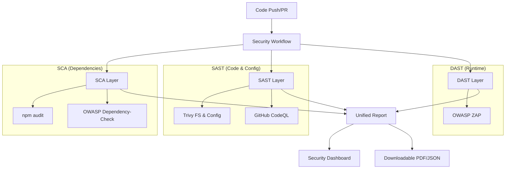

# 🛡️ Vulnerability Testing (VT) Pipeline Documentation

## 📋 Overview

This repository implements a state-of-the-art **DevSecOps Pipeline** designed to automatically detect, report, and visualize security vulnerabilities throughout the software development lifecycle. The pipeline integrates **SCA**, **SAST**, and **DAST** testing methodologies into a unified GitHub Actions workflow.

---

## 🏗️ Architecture

The security pipeline consists of three main layers:



---

## 🛠️ Tools & Technologies

### 1. Software Composition Analysis (SCA)
Focuses on open-source libraries and third-party dependencies.

- **npm audit**: Checks `package-lock.json` against the npm security registry for known vulnerabilities in Node.js packages.
- **OWASP Dependency-Check**: A deeper analysis tool that identifies project dependencies and checks if there are any known, publicly disclosed, vulnerabilities (CVEs).

### 2. Static Application Security Testing (SAST)
Analyzes source code and configuration files without executing the application.

- **Trivy**: Scans the filesystem for vulnerabilities in OS packages (if containerized) and misconfigurations in IaC (Infrastructure as Code) files.
- **GitHub CodeQL**: A semantic code analysis engine that discovers vulnerabilities across the codebase by treating code as data. It detects logic errors like SQL Injection, XSS, and insecure object deserialization.

### 3. Dynamic Application Security Testing (DAST)
Attacks the running application from the outside, simulating a real hacker.

- **OWASP ZAP (Zed Attack Proxy)**: Performs active scanning against the deployed application (e.g., on Render). It detects runtime issues like missing security headers, broken authentication, and exposure of sensitive data.

---

## 📊 Reporting & Visualization

### 1. Unified Security Report
A developer-friendly **PDF and Markdown report** is generated after every scan, containing:
- **Executive Summary**: High-level stats (Critical, High, Medium, Low).
- **Dependency Tree**: Shows exactly which library introduced a vulnerability (e.g., `A -> B -> C`).
- **Direct Fix Links**: Clickable links to CVE details and remediation steps.
- **Dev vs. Prod**: Separates vulnerabilities affecting production from those in development tools.
- **Diff Report**: Compares the current scan with the previous one to show progress (e.g., "Fixed 3 vulnerabilities").

### 2. Security Dashboard
A live, interactive HTML dashboard hosted on **GitHub Pages**:
- **Real-time Stats**: Visualizes vulnerability trends over time.
- **Charts**: Breakdown of issues by severity.
- **Auto-Update**: Automatically refreshes after every successful pipeline run.

---

## 🚀 Workflow Triggers

The pipeline runs automatically on:
- **Push**: To `main` or `devops` branches.
- **Pull Request**: To prevent vulnerable code from merging.
- **Schedule**: Weekly scans (e.g., Mondays at 2 AM) to catch newly discovered CVEs in old code.
- **Manual**: Can be triggered via "Run workflow" button.

---

## 🔄 Reusable Workflow

This pipeline is designed as a **Reusable Workflow**, meaning other repositories can use it with just a few lines of code.

### How to use in another repo:

Create `.github/workflows/security.yml`:

```yaml
name: Security Scan
on: [push, pull_request]

jobs:
  security:
    uses: Owner/Repo/.github/workflows/reusable-security.yml@main
    with:
      project_type: 'node'
      dast_url: 'https://your-app-url.com'
    secrets: inherit
```

---

## 🛑 Security Policy

The pipeline enforces a strict security policy:
- **Build Failure**: The build fails if **CRITICAL** vulnerabilities are found.
- **Artifact Retention**: Reports are saved for 90 days.
- **Secret Scanning**: GitHub Advanced Security prevents committing secrets (API keys, tokens).

---

## 📝 How to Fix Vulnerabilities

The report provides actionable steps:

1. **Dependencies**:
   ```bash
   npm audit fix
   ```
2. **Code Logic**:
   - Review CodeQL alerts in the "Security" tab.
   - Follow the remediation advice provided in the SARIF output.
3. **Runtime**:
   - Check ZAP report for missing headers (e.g., `HSTS`, `X-Frame-Options`).
   - Update server configuration (e.g., `next.config.js` or Nginx).

---

## 📂 Artifacts Location

After a run, check the **Summary** page for:
- `security-reports`: Contains PDF, HTML, and JSON reports.
- `codeql-results`: SARIF file for code analysis.
- `zap-scan-reports`: Detailed DAST findings.
