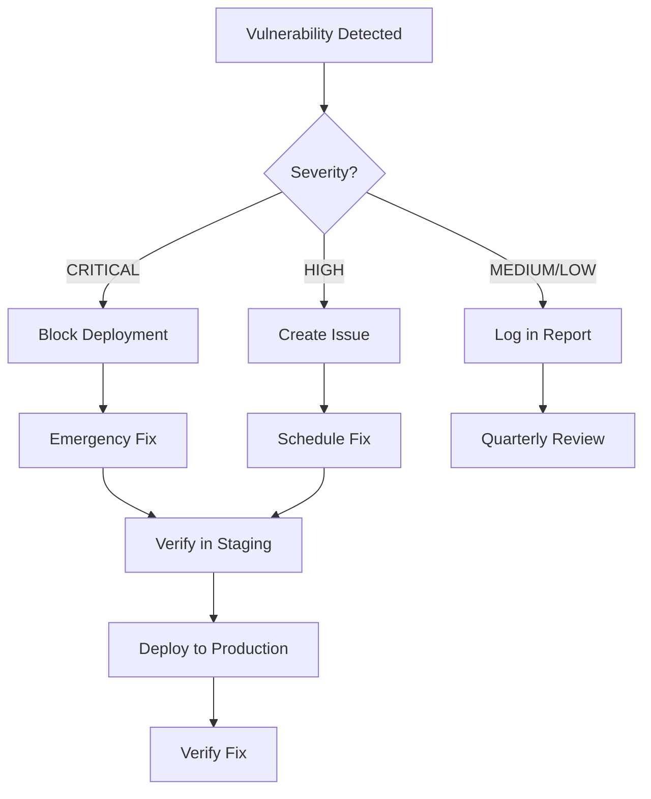

# Security Policy

## Vulnerability Management Requirements

This document defines the cybersecurity requirements for technical vulnerabilities management within the organization.

### 1. Policy Statement

All applications and infrastructure components shall be regularly assessed for security vulnerabilities. Identified vulnerabilities shall be classified, prioritized, and remediated according to their severity and associated cyber risks.

**Approved by:** [Security Team]  
**Effective Date:** 2026-01-28  
**Review Cycle:** Quarterly

---

## 2. Scope

This policy applies to:
- All source code repositories
- Application dependencies and libraries
- Infrastructure as Code (IaC) configurations
- Container images and Dockerfiles
- Deployed applications and services

---

## 3. Vulnerability Assessment Requirements

### 3.1 Periodic Scanning

**Automated Scans:**
- ✅ On every code push to main branches
- ✅ On every pull request
- ✅ Weekly scheduled scans (Monday 02:00 UTC)

**Scan Types:**
- **SCA (Software Composition Analysis):** npm audit, OWASP Dependency-Check
- **SAST (Static Application Security Testing):** Trivy filesystem scan
- **IaC Scanning:** Trivy configuration scan
- **DAST (Dynamic Application Security Testing):** OWASP ZAP (staging/production)

### 3.2 Detection Tools

| Tool | Purpose | Frequency |
|------|---------|-----------|
| npm audit | Node.js dependency vulnerabilities | Every commit |
| OWASP Dependency-Check | Multi-language SCA | Every commit |
| Trivy | SAST + IaC + Container scanning | Every commit |
| OWASP ZAP | DAST for running applications | Weekly + Pre-release |

---

## 4. Vulnerability Classification

Vulnerabilities are classified using the CVSS (Common Vulnerability Scoring System) standard:

| Severity | CVSS Score | Response Time | Action Required |
|----------|------------|---------------|-----------------|
| **CRITICAL** | 9.0 - 10.0 | 24 hours | Immediate fix, block deployment |
| **HIGH** | 7.0 - 8.9 | 7 days | Prioritize in current sprint |
| **MEDIUM** | 4.0 - 6.9 | 30 days | Schedule in next sprint |
| **LOW** | 0.1 - 3.9 | 90 days | Address in maintenance cycle |

---

## 5. Remediation Process

### 5.1 Severity-Based Remediation

**CRITICAL Vulnerabilities:**
1. Automated workflow **FAILS** the build
2. Deployment to production is **BLOCKED**
3. GitHub Issue created automatically
4. Security team notified immediately
5. Fix must be deployed within 24 hours

**HIGH Vulnerabilities:**
1. Warning issued in workflow
2. GitHub Issue created
3. Must be fixed before next release
4. Weekly review in security meeting

**MEDIUM/LOW Vulnerabilities:**
1. Logged in security reports
2. Addressed during regular maintenance
3. Tracked in quarterly security review

### 5.2 Remediation Workflow

---

## 6. Patch Management

### 6.1 Automated Dependency Updates

- **Dependabot** enabled for all repositories
- Automated PRs for security updates
- Weekly dependency update checks

### 6.2 Verification Process

**Before Production Deployment:**
1. ✅ All automated tests pass
2. ✅ Security scans show no CRITICAL/HIGH issues
3. ✅ Staging environment verification
4. ✅ Rollback plan documented

**Staging Verification:**
- Deploy patch to staging environment
- Run full security scan suite
- Perform smoke tests
- Monitor for 24 hours before production

### 6.3 Emergency Patches

For zero-day vulnerabilities:
1. Immediate assessment of impact
2. Temporary mitigation (WAF rules, network isolation)
3. Expedited patch deployment
4. Post-incident review

---

## 7. Vulnerability Intelligence

### 7.1 Trusted Sources

The organization subscribes to the following vulnerability feeds:

- ✅ **GitHub Security Advisories** (enabled)
- ✅ **National Vulnerability Database (NVD)**
- ✅ **CISA Known Exploited Vulnerabilities (KEV) Catalog**
- ⚠️ **Vendor-specific security bulletins** (manual monitoring)

### 7.2 Monitoring & Alerts

- GitHub Security Advisories notifications enabled
- Weekly digest of new vulnerabilities
- Immediate alerts for CRITICAL vulnerabilities in dependencies

---

## 8. Reporting & Documentation

### 8.1 Automated Reports

Generated for every scan:
- PDF security report with executive summary
- JSON reports for tool integration
- Severity breakdown and trend analysis

### 8.2 Periodic Reviews

**Weekly:**
- Review new HIGH/CRITICAL findings
- Track remediation progress

**Monthly:**
- Security metrics dashboard review
- Trend analysis

**Quarterly:**
- Comprehensive security posture review
- Policy effectiveness assessment
- Update security requirements as needed

---

## 9. Roles & Responsibilities

| Role | Responsibility |
|------|----------------|
| **Development Team** | Fix vulnerabilities, implement secure coding practices |
| **DevOps Team** | Maintain security pipelines, manage infrastructure |
| **Security Team** | Define policies, review findings, approve exceptions |
| **Management** | Approve policy, allocate resources, review metrics |

---

## 10. Compliance & Audit

### 10.1 Evidence Collection

All security scans generate:
- Timestamped reports
- Artifact storage (90 days retention)
- Audit trail in GitHub Actions

### 10.2 Metrics Tracked

- Number of vulnerabilities by severity
- Mean Time To Remediate (MTTR)
- Scan coverage (% of repositories)
- Policy compliance rate

---

## 11. Exceptions & Waivers

Vulnerabilities that cannot be immediately remediated require:
1. Written risk assessment
2. Compensating controls documentation
3. Security team approval
4. Maximum 90-day waiver period
5. Executive sign-off for CRITICAL/HIGH

---

## 12. Policy Review

This policy shall be reviewed:
- **Quarterly** by Security Team
- **Annually** by Executive Management
- **Ad-hoc** after major security incidents

**Next Review Date:** 2026-04-28

---

## 13. Related Documents

- [Walkthrough: Security Workflow Implementation](../walkthrough.md)
- [Compliance Gap Analysis](../compliance-gap-analysis.md)
- [GitHub Actions Workflows](../.github/workflows/)

---

## Approval

| Name | Role | Signature | Date |
|------|------|-----------|------|
| [Name] | CISO | [Pending] | 2026-01-28 |
| [Name] | CTO | [Pending] | 2026-01-28 |
| [Name] | DevOps Lead | [Pending] | 2026-01-28 |

---

**Document Version:** 1.0  
**Last Updated:** 2026-01-28
